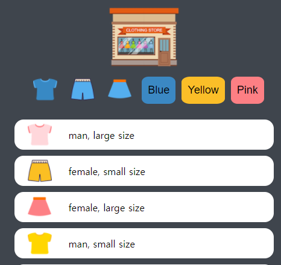
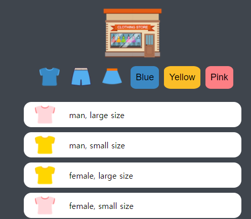
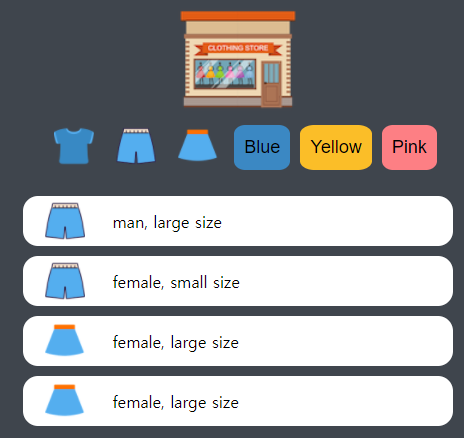

# **Project-shopping** 
HTML 레이아웃, javascript 및 css 복습과 현재 실력 테스트 용

## **Description**

* 렌덤 데이터 또는 json 데이터를 이용해서 쇼핑 item을 생성하고, 버튼을 이용하서 item을 분류하는 기능을 가진 프로젝트  

기능
 
 1. 홈 버튼 클릭 시 main 홈으로 이동
 2. 6개의 각 버튼클릭 시 item을 선별
    - 옷 모양의 버튼의 경우 item에 맞는 타입의 옷을 선별
    - 색상이 있는 버튼의 경우 item에 맞는 생상의 옷을 선별

## **file**

> index.html : 초기 파일, Onclick 함수를 사용

> src/main.js : json 데이터를 사용하지 않고 렌덤으로 item 생성 함수 및 동적으로 html 생성

> src/btnEvent.js : 버튼 이벤트 함수, 

> index2.jtml : 기존의 index.html에서 Onclick를 삭제한 버전

> src/main2.js : json 데이터를 사용해서 item 생성, EventListener를 사용한 버튼 이벤트 함수 , 동적 html 생성

> data/data.json : item생성을 위한 json 형식의 데이터 

## **예제**

6개의 버튼중 왼쪽의 파란색 티 버튼을 클릭할 경우 이와 같이 같은 타입의 옷만 출력하는 기능

6개의 버튼중 blue 버튼을 클릭할 경우 이와 같이 같은 색상의 옷만 출력하는 기능

